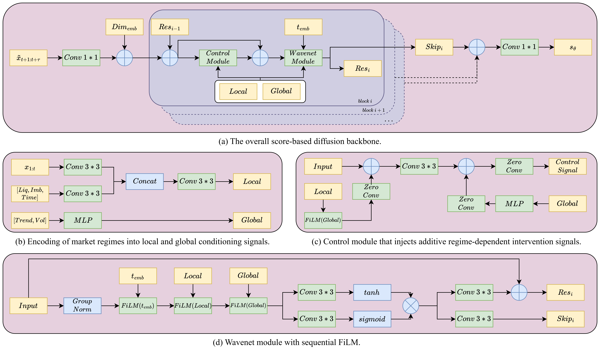
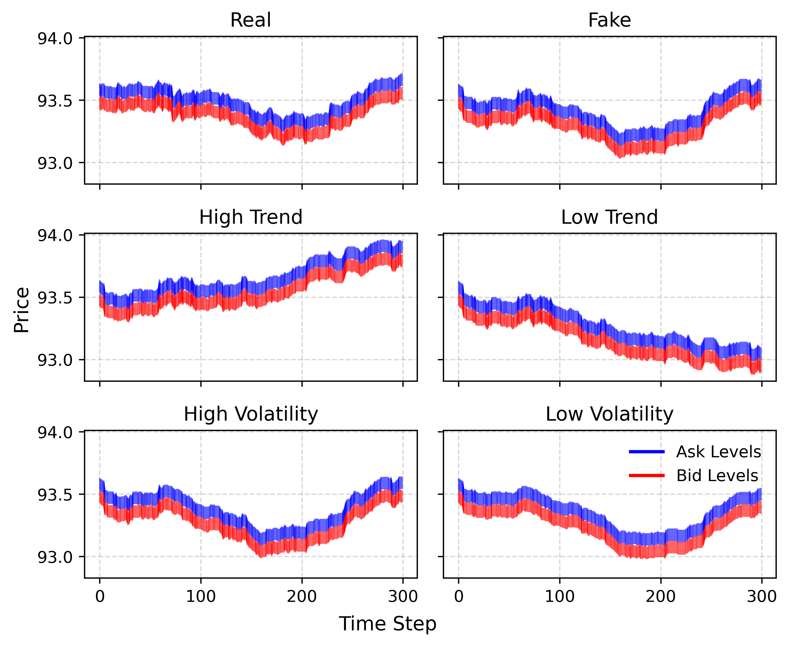
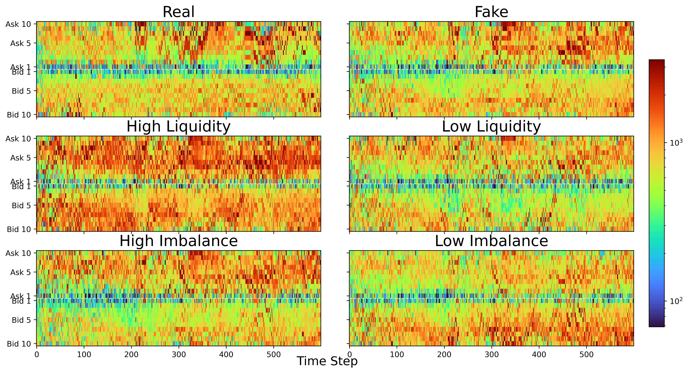

# DiffLOB: Diffusion Models for Counterfactual Generation in Limit Order Books

This repository contains the official implementation of **DiffLOB**, a score-based diffusion framework for **controllable and counterfactual generation of limit order book (LOB) trajectories** under future market regime interventions.

DiffLOB explicitly conditions the generative process on **future market regimes**—including **trend, volatility, liquidity, and order-flow imbalance**—and enables direct counterfactual queries of the form:

> *“If the future market regime were different, how would the LOB evolve?”*

---

## 🔍 Overview

Existing generative models for limit order books primarily focus on reproducing realistic market dynamics, but remain fundamentally **passive**: they model what typically happens, rather than what would happen under hypothetical future conditions.

DiffLOB addresses this limitation by:
- Formulating LOB generation as a **conditional score-based diffusion problem**
- Explicitly introducing **future market regimes** as control variables
- Enabling **counterfactual interventions** without relying on agent-based interaction
- Demonstrating the usefulness of counterfactual trajectories for downstream tasks

Model architecture is shown by following graph:

<p align="center">
  
</p>

---

## ✨ Key Features

- **Score-based diffusion model (VP-SDE)** for LOB trajectories
- Explicit conditioning on **future market regimes**
- **ControlNet-style control module** for regime-aware intervention
- **Two-stage training strategy** for stable controllable generation
- **Classifier-free guidance** for flexible conditional sampling
- **Ancestral sampling** of the reverse-time SDE
- Joint modeling of **price and volume dynamics**
- Extensive evaluation on realism, counterfactual validity, and downstream usefulness

---

## 🧠 Building Conditioning Variables

DiffLOB requires future market regime conditions to be precomputed before training and sampling.
These conditioning variables are constructed using the script:

```bash
python build_conds.py
```

---

## ▶️ Running Training and Sampling Scripts

All training and sampling procedures are managed through scripts in the `scripts/` directory. Run:

```bash
bash scripts/AMZN/diff_wavenet_motion_control.sh
```

---

## 🎲 Sampling Examples

Below we show representative sampled LOB trajectory snippets generated by DiffLOB.
Unless otherwise specified, figures are shown on **AMZN**.

<p align="center">
  
</p>


<p align="center">
  
</p>


## 📚 Citation

If you find this repository useful for your research, please consider citing our paper:

```bibtex
@article{wang2025difflob,
  title     = {DiffLOB: Diffusion Models for Counterfactual Generation in Limit Order Books},
  author    = {Wang, Zhuohan and Ventre, Carmine},
  journal   = {arXiv preprint},
  year      = {2026}
}
```